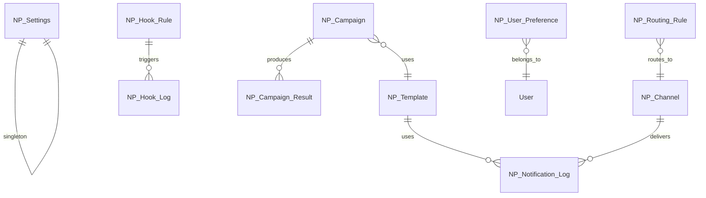

# NotifyPro — Architecture

## App Identity

| Property     | Value              |
| ------------ | ------------------ |
| **App Name** | notifypro          |
| **Prefix**   | NP                 |
| **Color**    | `#7C3AED` (Violet) |
| **Version**  | 0.0.1              |
| **License**  | MIT                |

## Required Apps

```
frappe >= 16.0.0
frappe_visual >= 0.1.0
arkan_help >= 0.0.1
base_base >= 0.0.1
```

## Module Map

| Module          | DocTypes                                                                    | Purpose                      |
| --------------- | --------------------------------------------------------------------------- | ---------------------------- |
| NP Settings     | NP Settings                                                                 | Global app configuration     |
| NP Core         | NP Notification Log, NP Queue, NP Batch                                     | Core notification processing |
| Channels        | NP Channel, NP Channel Provider, NP Channel Health                          | Channel management           |
| Templates       | NP Template, NP Template Variable, NP Template Version                      | Message templates            |
| Campaigns       | NP Campaign, NP Campaign Audience, NP Campaign Schedule, NP Campaign Result | Campaign scheduling          |
| NP Hooks        | NP Hook Rule, NP Hook Condition, NP Hook Log                                | DocType event triggers       |
| Preferences     | NP User Preference, NP Opt Out, NP Quiet Hours                              | User notification settings   |
| Analytics       | NP Delivery Report, NP Analytics Snapshot, NP Click Track                   | Delivery analytics           |
| Routing         | NP Routing Rule, NP Priority Matrix, NP Fallback Chain                      | Smart routing                |
| NP Integrations | NP Webhook, NP External Provider                                            | External integrations        |

## Services

| Service             | File                               | Responsibilities                        |
| ------------------- | ---------------------------------- | --------------------------------------- |
| NotificationService | `services/notification_service.py` | Send, queue, batch notifications        |
| TemplateService     | `services/template_service.py`     | Render templates, variable substitution |
| CampaignService     | `services/campaign_service.py`     | Execute campaigns, audience filtering   |
| RoutingService      | `services/routing_service.py`      | Route to channels, priority, fallback   |
| ChannelService      | `services/channel_service.py`      | Channel health, provider management     |
| AnalyticsService    | `services/analytics_service.py`    | Delivery stats, click tracking          |

## Channel Providers

| Provider         | File                             | Channels                       |
| ---------------- | -------------------------------- | ------------------------------ |
| BaseProvider     | `providers/base_provider.py`     | Abstract base class            |
| EmailProvider    | `providers/email_provider.py`    | Email via Frappe Email Account |
| SMSProvider      | `providers/sms_provider.py`      | SMS via configured gateway     |
| WhatsAppProvider | `providers/whatsapp_provider.py` | WhatsApp Business API          |
| TelegramProvider | `providers/telegram_provider.py` | Telegram Bot API               |
| PushProvider     | `providers/push_provider.py`     | Web Push / FCM                 |

## API Endpoints (v1)

| Endpoint                                   | Method | File                      |
| ------------------------------------------ | ------ | ------------------------- |
| `notifypro.api.v1.notifications.send`      | POST   | `api/v1/notifications.py` |
| `notifypro.api.v1.channels.get_channels`   | GET    | `api/v1/channels.py`      |
| `notifypro.api.v1.templates.get_templates` | GET    | `api/v1/templates.py`     |

## CAPS Capabilities (15)

| Capability             | Category | Description                  |
| ---------------------- | -------- | ---------------------------- |
| NP_manage_settings     | Module   | Configure app settings       |
| NP_manage_channels     | Module   | Create/edit channels         |
| NP_send_notifications  | Action   | Send notifications           |
| NP_manage_templates    | Module   | Create/edit templates        |
| NP_run_campaigns       | Action   | Execute campaigns            |
| NP_view_analytics      | Report   | View delivery analytics      |
| NP_manage_hooks        | Module   | Configure hook rules         |
| NP_manage_routing      | Module   | Configure routing rules      |
| NP_view_logs           | Report   | View notification logs       |
| NP_manage_preferences  | Module   | Manage user preferences      |
| NP_bulk_send           | Action   | Send bulk notifications      |
| NP_export_reports      | Report   | Export analytics reports     |
| NP_manage_webhooks     | Module   | Configure webhooks           |
| NP_api_access          | Action   | Use API endpoints            |
| NP_manage_integrations | Module   | Configure external providers |

## ERD (Simplified)


