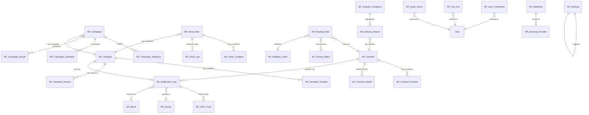

# NotifyPro — Entity Relationship Diagram

# مخطط علاقات الكيانات — NotifyPro

```mermaid
erDiagram
    NP_Settings ||--|| NP_Settings : singleton

    NP_Channel ||--o{ NP_Channel_Provider : "has providers"
    NP_Channel ||--o{ NP_Channel_Health : "health checks"
    NP_Channel ||--o{ NP_Notification_Log : "delivers via"

    NP_Template ||--o{ NP_Template_Variable : "has variables"
    NP_Template ||--o{ NP_Template_Version : "has versions"
    NP_Template ||--o{ NP_Notification_Log : "used by"

    NP_Campaign ||--o{ NP_Campaign_Audience : "targets"
    NP_Campaign ||--o{ NP_Campaign_Schedule : "scheduled"
    NP_Campaign ||--o{ NP_Campaign_Result : "produces"
    NP_Campaign }o--|| NP_Template : "uses template"

    NP_Notification_Log ||--o{ NP_Click_Track : "tracks clicks"
    NP_Notification_Log }o--o| NP_Queue : "queued in"
    NP_Notification_Log }o--o| NP_Batch : "batched in"

    NP_Hook_Rule ||--o{ NP_Hook_Condition : "has conditions"
    NP_Hook_Rule ||--o{ NP_Hook_Log : "produces logs"
    NP_Hook_Rule }o--|| NP_Template : "uses template"

    NP_Routing_Rule }o--|| NP_Channel : "routes to"
    NP_Routing_Rule }o--o| NP_Priority_Matrix : "uses priority"
    NP_Routing_Rule }o--o| NP_Fallback_Chain : "fallback"

    NP_User_Preference }o--|| User : "belongs to"
    NP_Opt_Out }o--|| User : "opted out"
    NP_Quiet_Hours }o--|| User : "quiet hours"

    NP_Delivery_Report }o--|| NP_Channel : "per channel"
    NP_Analytics_Snapshot ||--|{ NP_Delivery_Report : "aggregates"

    NP_Webhook ||--o{ NP_External_Provider : "sends to"
```
