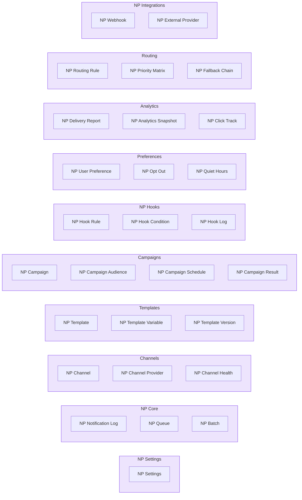

# NotifyPro — Module Map
# خريطة الوحدات — NotifyPro

```mermaid
graph LR
    subgraph NP_Settings["NP Settings"]
        s1["NP Settings"]
    end
    subgraph NP_Core["NP Core"]
        c1["NP Notification Log"]
        c2["NP Queue"]
        c3["NP Batch"]
    end
    subgraph Channels
        ch1["NP Channel"]
        ch2["NP Channel Provider"]
        ch3["NP Channel Health"]
    end
    subgraph Templates
        t1["NP Template"]
        t2["NP Template Variable"]
        t3["NP Template Version"]
    end
    subgraph Campaigns
        ca1["NP Campaign"]
        ca2["NP Campaign Audience"]
        ca3["NP Campaign Schedule"]
        ca4["NP Campaign Result"]
    end
    subgraph NP_Hooks["NP Hooks"]
        h1["NP Hook Rule"]
        h2["NP Hook Condition"]
        h3["NP Hook Log"]
    end
    subgraph Preferences
        p1["NP User Preference"]
        p2["NP Opt Out"]
        p3["NP Quiet Hours"]
    end
    subgraph Analytics
        a1["NP Delivery Report"]
        a2["NP Analytics Snapshot"]
        a3["NP Click Track"]
    end
    subgraph Routing
        r1["NP Routing Rule"]
        r2["NP Priority Matrix"]
        r3["NP Fallback Chain"]
    end
    subgraph NP_Integrations["NP Integrations"]
        i1["NP Webhook"]
        i2["NP External Provider"]
    end

    style NP_Settings fill:#7C3AED22,stroke:#7C3AED
    style NP_Core fill:#7C3AED22,stroke:#7C3AED
    style Channels fill:#7C3AED22,stroke:#7C3AED
    style Templates fill:#7C3AED22,stroke:#7C3AED
    style Campaigns fill:#7C3AED22,stroke:#7C3AED
    style NP_Hooks fill:#7C3AED22,stroke:#7C3AED
    style Preferences fill:#7C3AED22,stroke:#7C3AED
    style Analytics fill:#7C3AED22,stroke:#7C3AED
    style Routing fill:#7C3AED22,stroke:#7C3AED
    style NP_Integrations fill:#7C3AED22,stroke:#7C3AED
```
